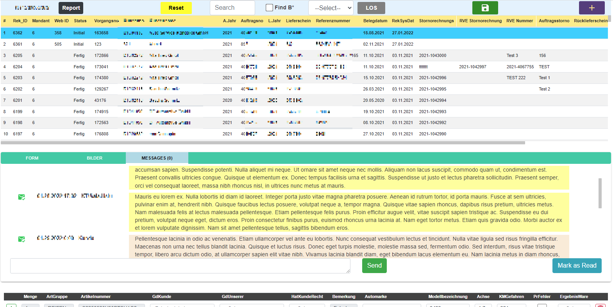

<h2 align="left">Reklamations</h2>

<h4 align="left">A web app implemented using Blazor, .NET 5 and EF Core</h4>

<h6 align="left">This app keeps the records for the complaints from customers. On the application authorized users can 
Create, Read, Update and Delete complaint objects and other related objects. Users can also send and recieve messages from customers through a web service.
Customers are notified when an email sent to their account.
</h6>

 

